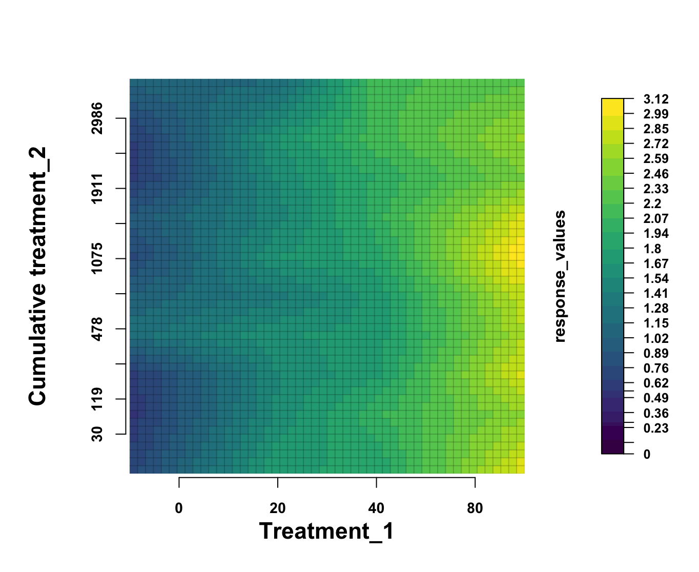

# Raster Color Map Visualization

This repository contains an R script and example data for generating a color‐mapped heat‐plot of treatment responses using the **raster** and **viridis** packages. It illustrates how to:

1. Compute cumulative treatment intensity.
2. Map factor levels to numeric values.
3. Summarize response values over treatment combinations.
4. Convert the summary to a raster and draw a color map with a custom legend.

---

## Repository Structure
```bash
root/
├── example_data.csv        # Example input data (days, treatments, response values)
├── raster_color_map.R      # R script to process data and generate the plot
└── README.md               # This file
```

---

## Prerequisites

- **R** (≥ 3.5.0)
- The following R packages:
  - `tidyverse`
  - `zoo`
  - `raster`
  - `viridis`

You can install any missing packages at the R console:

```r
install.packages(c("tidyverse", "zoo", "raster", "viridis"))
```

## Data Format (example_data.csv)

Your CSV should include at least the following columns:|
| Column            | Type     | Description                                                                 |
| ----------------- | -------- | --------------------------------------------------------------------------- |
| `days`            | integer  | Time point (e.g., days since the start of treatment)                       |
| `trt_1`           | factor   | Categorical treatment levels (`level0`, `level1`, `level2`, `level3`)      |
| `trt_2`           | numeric  | Second treatment variable (e.g., concentration or intensity)               |
| `response_values` | numeric  | Measured response at each combination of `days`, `trt_1`, and `trt_2`      |
| `reps`            | integer  | Replicate identifier (optional; used if you want to average over repeats)  |

## Usage
1.	Clone this repository (or download the two files) so that both example_data.csv and raster_color_map.R live in the same folder.

2.	Open R (or RStudio) and set your working directory to this folder:
```r
setwd("/path/to/this/repo")
```

3. Source the script (or run it line by line) to generate the plot:
```r
source("raster_color_map.R")
```

4. The script will:
	•	Read in example_data.csv.
	•	Compute a cumulative treatment variable (cum_trt2).
	•	Map trt_1 levels to µM numeric values.
	•	Summarize response_values across the grid of treatments.
	•	Build a raster and display a color map with a side legend.

5. Customizing the X/Y-Axis Label (based on your own treatment)

## Example plot


